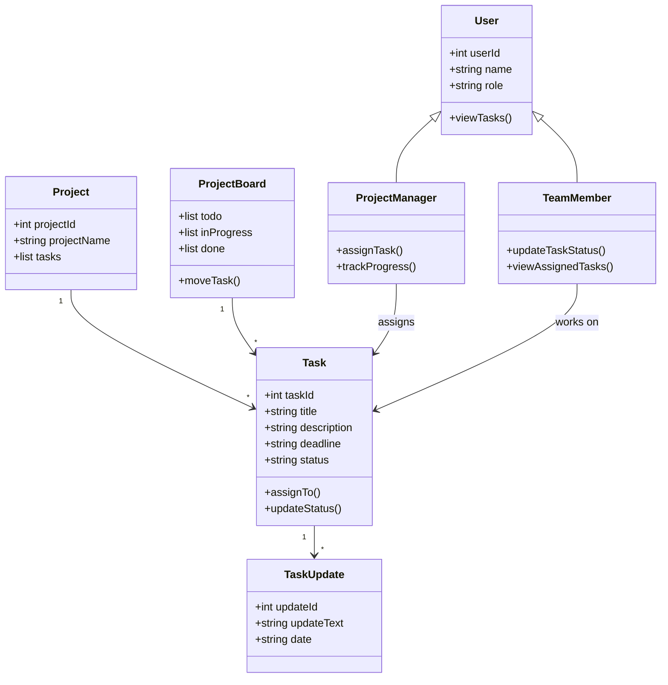

# Class Diagram

```mermaid
classDiagram
    class User {
        +int userId
        +string name
        +string role
        +viewTasks()
    }

    class ProjectManager {
        +assignTask()
        +trackProgress()
    }

    class TeamMember {
        +updateTaskStatus()
        +viewAssignedTasks()
    }

    class Project {
        +int projectId
        +string projectName
        +list tasks
    }

    class Task {
        +int taskId
        +string title
        +string description
        +string deadline
        +string status
        +assignTo()
        +updateStatus()
    }

    class TaskUpdate {
        +int updateId
        +string updateText
        +string date
    }

    class ProjectBoard {
        +list todo
        +list inProgress
        +list done
        +moveTask()
    }

    User <|-- ProjectManager
    User <|-- TeamMember
    Project "1" --> "*" Task
    Task "1" --> "*" TaskUpdate
    ProjectBoard "1" --> "*" Task
    ProjectManager --> Task : assigns
    TeamMember --> Task : works on
```
