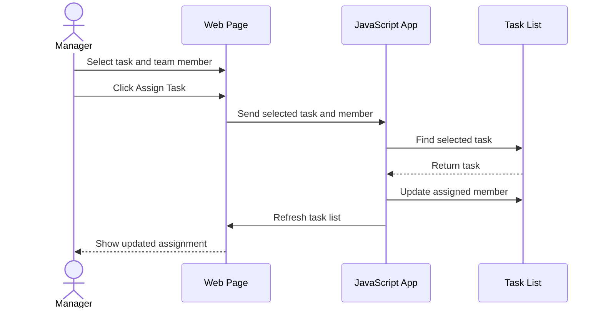

# Sequence Diagram: Assign Team Task

```mermaid
sequenceDiagram
    actor Manager
    participant Page as Web Page
    participant App as JavaScript App
    participant TaskList as Task List

    Manager->>Page: Select task and team member
    Manager->>Page: Click Assign Task
    Page->>App: Send selected task and member
    App->>TaskList: Find selected task
    TaskList-->>App: Return task
    App->>TaskList: Update assigned member
    App->>Page: Refresh task list
    Page-->>Manager: Show updated assignment
```
