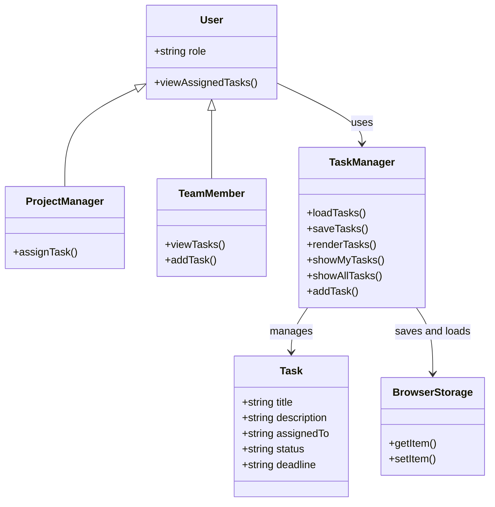

# Class Diagram

```mermaid
classDiagram
    class User {
        +string role
        +viewAssignedTasks()
    }

    class ProjectManager {
        +assignTask()
    }

    class TeamMember {
        +viewTasks()
        +addTask()
    }

    class Task {
        +string title
        +string description
        +string assignedTo
        +string status
        +string deadline
    }

    class TaskManager {
        +loadTasks()
        +saveTasks()
        +renderTasks()
        +showMyTasks()
        +showAllTasks()
        +addTask()
    }

    class BrowserStorage {
        +getItem()
        +setItem()
    }

    User <|-- ProjectManager
    User <|-- TeamMember
    TaskManager --> Task : manages
    TaskManager --> BrowserStorage : saves and loads
    User --> TaskManager : uses
```
