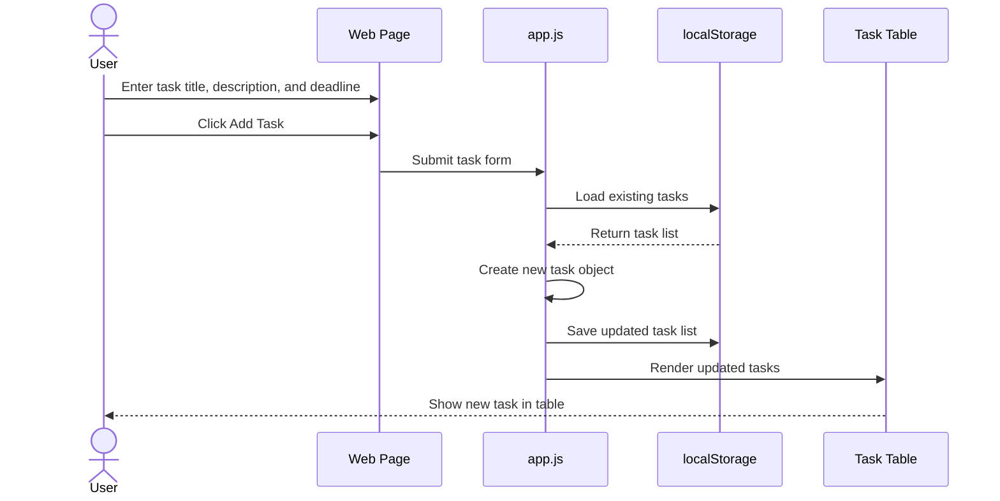

# Sequence Diagram: Add New Task

This sequence diagram illustrates the key operation implemented in the Week 3 prototype: adding a new task.

```mermaid
sequenceDiagram
    actor User
    participant Page as Web Page
    participant App as app.js
    participant Storage as localStorage
    participant Table as Task Table

    User->>Page: Enter task title, description, and deadline
    User->>Page: Click Add Task
    Page->>App: Submit task form
    App->>Storage: Load existing tasks
    Storage-->>App: Return task list
    App->>App: Create new task object
    App->>Storage: Save updated task list
    App->>Table: Render updated tasks
    Table-->>User: Show new task in table
```
