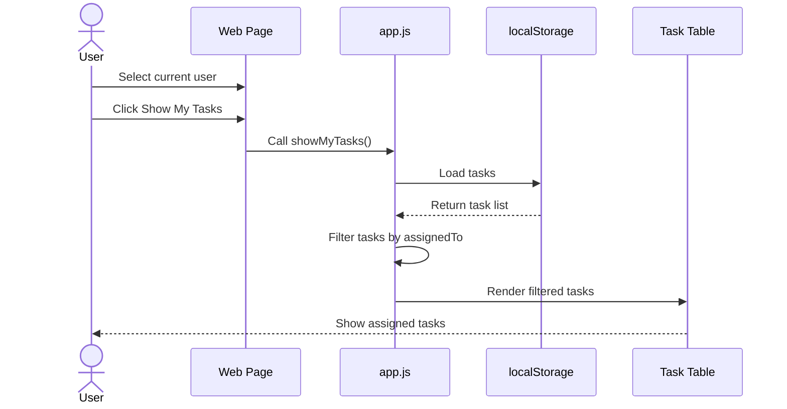

# Sequence Diagram: View My Assigned Tasks

```mermaid
sequenceDiagram
    actor User
    participant Page as Web Page
    participant App as app.js
    participant Storage as localStorage
    participant Table as Task Table

    User->>Page: Select current user
    User->>Page: Click Show My Tasks
    Page->>App: Call showMyTasks()
    App->>Storage: Load tasks
    Storage-->>App: Return task list
    App->>App: Filter tasks by assignedTo
    App->>Table: Render filtered tasks
    Table-->>User: Show assigned tasks
```
